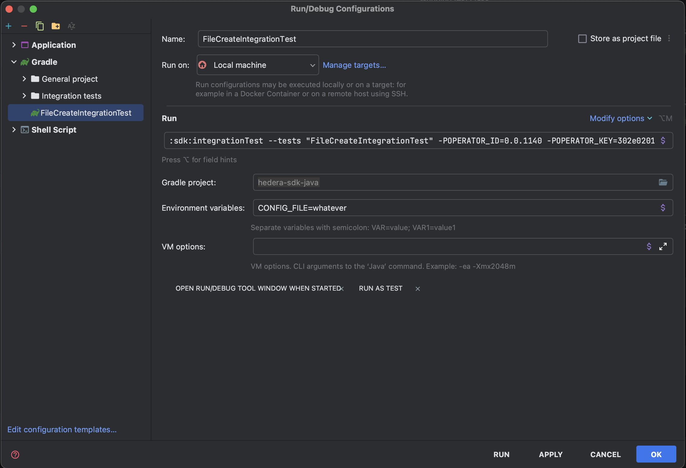

## JVM
JDK 17 is required. The Temurin builds of [Eclipse Adoptium](https://adoptium.net/) are strongly recommended.

## Setup
> Note that the below `./gradlew` commands should be run from the root of the project.

### Building

```sh
./gradlew assemble
```

### Unit Tests

```sh
./gradlew :sdk:test
```

### Integration Tests

> The tests are only executed if the configuration is provided.
> That's why we need to pass the configuration file at the beginning of the command.

#### Using Gradle properties
`OPERATOR_ID`, `OPERATOR_KEY` and `HEDERA_NETWORK` must be passed as Gradle properties (`-P` parameters).\
`HEDERA_NETWORK` can be set to `localhost`, `testnet` or `previewnet`.

```sh
./gradlew :sdk:testIntegration -POPERATOR_ID="<shard.realm.num>" -POPERATOR_KEY="<PrivateKey>" -PHEDERA_NETWORK="<network>"
```

#### Using configuration file

```sh
./gradlew :sdk:testIntegration -PCONFIG_FILE="<ConfigurationFilePath>"
```

An example configuration file can be found in the repo here:
[sdk/src/test/resources/client-config-with-operator.json](../../sdk/src/test/resources/client-config-with-operator.json)

**Running against the local network**

The format of the configuration file should be as follows:
```json
{
    "network": {
        "0.0.3": "127.0.0.1:50211"
    },
    "mirrorNetwork": [
        "127.0.0.1:5600"
    ],
    "operator": {
        "accountId": "0.0.1022",
        "privateKey": "0xa608e2130a0a3cb34f86e757303c862bee353d9ab77ba4387ec084f881d420d4"
    }
}

```

**Running against remote networks**

The format of the configuration file should be as follows:
```json
{
    "network": "testnet",
    "operator": {
        "accountId": "0.0.7",
        "privateKey": "d5d37..."
    }
}
```

`HEDERA_NETWORK` can be set to `testnet`, `previewnet` or `mainnet`.

#### Running individual test classes or functions

Running test class:
```sh
./gradlew :sdk:testIntegration -POPERATOR_ID="<shard.realm.num>" -POPERATOR_KEY="<PrivateKey>" -PHEDERA_NETWORK="testnet" --tests "<TestClass>"
```

Running test function:
```sh
./gradlew :sdk:testIntegration -POPERATOR_ID="<shard.realm.num>" -POPERATOR_KEY="<PrivateKey>" -PHEDERA_NETWORK="testnet" --tests "<TestClass.functionName>"
```

#### Running with Intellij IDEA
1. Create a new Gradle run configuration (easiest way is to run test class or individual test function from the IDE).
2. Update "Run" configuration to pass the required Gradle properties (`OPERATOR_ID`, `OPERATOR_KEY` and `HEDERA_NETWORK`).


## Maintaining generated files
>To execute the tasks below, you need to install the tool from this link: https://taskfile.dev/
> (these tasks are from the file Taskfile.yml, which is located in the root of the repository).
> Once installed, you can run the commands as shown below.
>
> Note that the below `task` commands should be run from the root of the project.

### Updating unit tests snapshots
```sh
task update:snapshots
```

### Updating proto files
```sh
task update:proto
```

### Updating address books
Update all address books:
```sh
task update:addressbooks
```
Update address books only for a mainnet:
```sh
task update:addressbooks:mainnet
```
Update address books only for a testnet:
```sh
task update:addressbooks:testnet
```
Update address books only for a previewnet:
```sh
task update:addressbooks:previewnet
```
