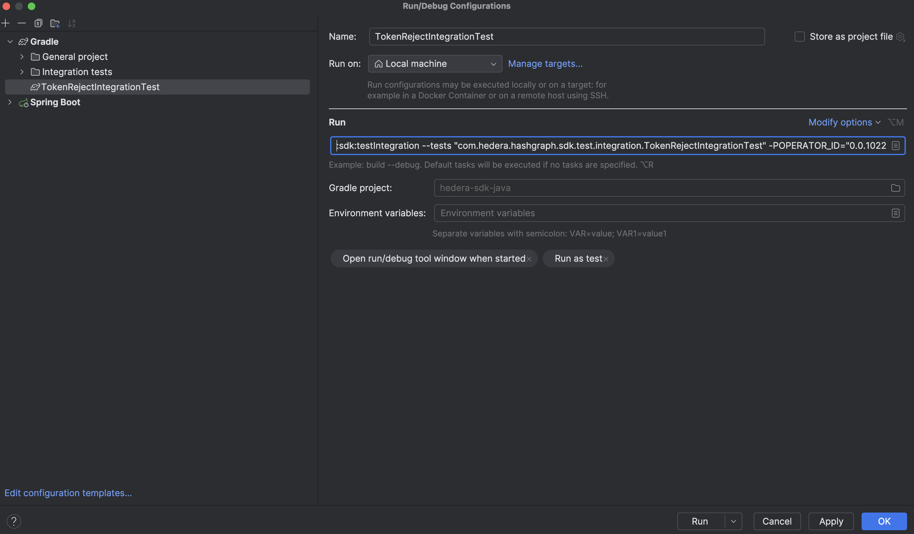

## JVM

JDK 17 is required. The Temurin builds of [Eclipse Adoptium](https://adoptium.net/) are strongly recommended.

## Setup

> Note that the below `./gradlew` commands should be run from the root of the project.

This project uses the
[Hiero Gradle Conventions](https://github.com/hiero-ledger/hiero-gradle-conventions)
Gradle setup. More details on how to work with the project can be found in the
[documentation](https://github.com/hiero-ledger/hiero-gradle-conventions#build).

### Building

```sh
./gradlew assemble
```

### Unit Tests

```sh
./gradlew :sdk:test
```

### Integration Tests

> The tests are only executed if the configuration is provided.
> That's why we need to pass the configuration file at the beginning of the command.

#### Using Gradle properties

`OPERATOR_ID`, `OPERATOR_KEY` and `HEDERA_NETWORK` must be passed as Gradle properties (`-P` parameters).\
`HEDERA_NETWORK` can be set to `localhost`, `testnet` or `previewnet`.

```sh
./gradlew :sdk:testIntegration -POPERATOR_ID="<shard.realm.num>" -POPERATOR_KEY="<PrivateKey>" -PHEDERA_NETWORK="<network>"
```

#### Using configuration file

```sh
./gradlew :sdk:testIntegration -PCONFIG_FILE="<ConfigurationFilePath>"
```

An example configuration file can be found in the repo here:
[sdk/src/test/resources/client-config-with-operator.json](../../sdk/src/test/resources/client-config-with-operator.json)

**Running against the local network**

The format of the configuration file should be as follows:

```json
{
    "network": {
        "0.0.3": "127.0.0.1:50211"
    },
    "mirrorNetwork": [
        "127.0.0.1:5600"
    ],
    "operator": {
        "accountId": "0.0.1022",
        "privateKey": "0xa608e2130a0a3cb34f86e757303c862bee353d9ab77ba4387ec084f881d420d4"
    }
}

```

**Running against remote networks**

The format of the configuration file should be as follows:

```json
{
    "network": "testnet",
    "operator": {
        "accountId": "0.0.7",
        "privateKey": "d5d37..."
    }
}
```

`HEDERA_NETWORK` can be set to `testnet`, `previewnet` or `mainnet`.

#### Running individual test classes or functions

Running test class:

```sh
./gradlew :sdk:testIntegration -POPERATOR_ID="<shard.realm.num>" -POPERATOR_KEY="<PrivateKey>" -PHEDERA_NETWORK="testnet" --tests "<TestClass>"
```

Running test function:

```sh
./gradlew :sdk:testIntegration -POPERATOR_ID="<shard.realm.num>" -POPERATOR_KEY="<PrivateKey>" -PHEDERA_NETWORK="testnet" --tests "<TestClass.functionName>"
```

#### Running with Intellij IDEA

1. Create a new Gradle run configuration (easiest way is to run test class or individual test function from the IDE).
2. Update "Run" configuration to pass the required Gradle properties (`OPERATOR_ID`, `OPERATOR_KEY` and `HEDERA_NETWORK`).
   

## Managing dependencies

This project uses a combination of Java Modules (JPMS) and Gradle to define and manage dependencies to 3rd party
libraries. In this structure, dependencies of the SDK are defined in
[sdk/src/main/java/module-info.java](../../sdk/src/main/java/module-info.java) (which is mirrored in
[sdk-full/src/main/java/module-info.java](../../sdk-full/src/main/java/module-info.java)).
Running `./gradlew qualityGate` contains a _dependency scope check_ that makes sure that both files are in sync.
Versions of 3rd party dependencies are defined in
[hiero-dependency-versions/build.gradle.kts](../../hiero-dependency-versions/build.gradle.kts).
More details about how to add/modify dependencies are found in the Hiero Gradle Conventions documentation on
[Defining modules and dependencies](https://github.com/hiero-ledger/hiero-gradle-conventions#modules).

## Maintaining generated files

> Note that the below `./gradlew` commands should be run from the root of the project.

### Updating unit tests snapshots

```sh
./gradlew updateSnapshots
```

### Updating proto files

```sh
./gradlew updateSnapshots
```

### Updating address books

Update all address books:

```sh
./gradlew examples:updateAddressbooks
```

Update address books only for a mainnet:

```sh
./gradlew examples:updateAddressbooksMainnet
```

Update address books only for a testnet:

```sh
./gradlew examples:updateAddressbooksTestnet
```

Update address books only for a previewnet:

```sh
./gradlew examples:updateAddressbooksPreviewnet
```
